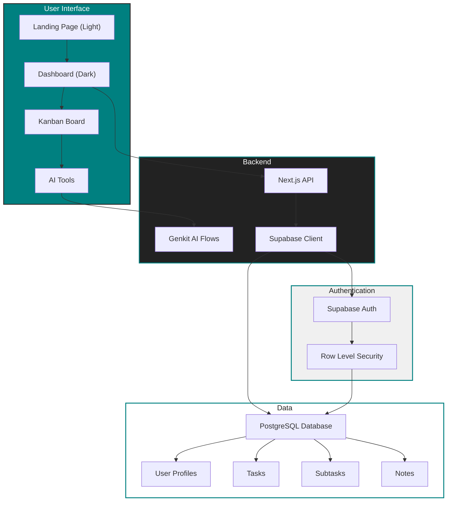

## System Diagram

```mermaid
flowchart TD
  subgraph UI[User Interface]
    style UI fill:#008080,stroke:#333,stroke-width:2,color:#fff
    A["Landing Page (Light)"]
    B["Dashboard (Dark)"]
    C["Kanban Board"]
    D["AI Tools"]
  end
  subgraph Backend[Backend]
    style Backend fill:#222,stroke:#008080,stroke-width:2,color:#fff
    E[Next.js API]
    F[Genkit AI Flows]
    G[Supabase Client]
  end
  subgraph Data[Data]
    style Data fill:#fff,stroke:#008080,stroke-width:2,color:#222
    H[PostgreSQL Database]
    I[User Profiles]
    J[Tasks]
    K[Subtasks]
    L[Notes]
  end
  subgraph Auth[Authentication]
    style Auth fill:#f0f0f0,stroke:#008080,stroke-width:2,color:#222
    M[Supabase Auth]
    N[Row Level Security]
  end
  A --> B --> C --> D
  D --> F
  B --> E
  E --> G
  G --> H
  H --> I
  H --> J
  H --> K
  H --> L
  G --> M
  M --> N
  N --> H
```
